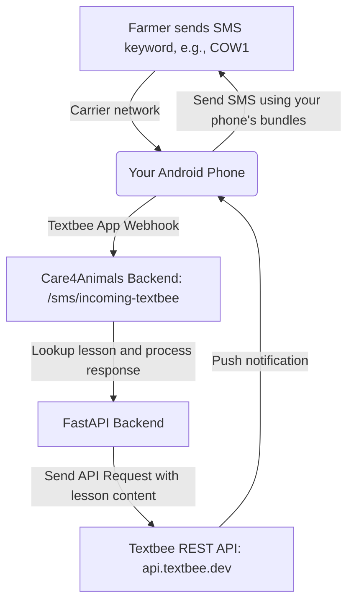

# Free SMS Integration Guide: Textbee Gateway

Since you already have SMS bundles on your Android device, you can use **Textbee** to turn your personal Android phone into a completely **free SMS gateway**! 

This guide details how to install, configure, and use Textbee with your Care4Animals V2 platform.

---

## How It Works



---

## Step 1: Create a Textbee Account
1. Visit the [Textbee Website](https://textbee.dev) or [textbee.dev](https://textbee.dev).
2. Register for a free account.
3. Once logged in, go to your **Dashboard**.

## Step 2: Set Up the Android Application
1. Download and install the **Textbee Android App** from the [Textbee GitHub Releases](https://github.com/hassan-kazi/textbee-android/releases) or the download link provided in the Textbee dashboard.
2. Open the app on your Android phone and grant the required permissions:
   - **Send SMS**
   - **Receive SMS**
   - **Read Phone State** (to detect when messages arrive)
   - **Background execution** (disable battery optimization so it runs continuously)
3. In your Web Dashboard, click **Register Device** to generate a QR Code or API Key.
4. Scan the QR code using your Textbee Android app (or type in the token) to pair your device.

## Step 3: Update Backend Configuration
Open the backend `.env` file located at `backend/.env` and update the values with your credentials from the Textbee dashboard:

```env
# Change the provider from "africastalking" to "textbee"
SMS_PROVIDER=textbee

# Enter your Textbee API Key and Device ID from the dashboard
TEXTBEE_API_KEY=your_textbee_api_key_here
TEXTBEE_DEVICE_ID=your_textbee_device_id_here
```

Restart your FastAPI backend server so it loads the new configuration.

---

## Step 4: Configure the Incoming SMS Webhook
To allow farmers to text your phone number and automatically get lessons:
1. In the **Textbee Dashboard**, look for the **Webhooks** section.
2. Set the Webhook URL to point to your Care4Animals backend endpoint:
   - **Endpoint:** `https://<your-backend-domain>/sms/incoming-textbee`
   - *For local testing:* If you are testing locally, you can use a tunneling tool like **ngrok** to expose your local port `8000`:
     ```bash
     ngrok http 8000
     ```
     Copy the `https://....ngrok-free.app` URL and configure the webhook as:
     `https://<your-subdomain>.ngrok-free.app/sms/incoming-textbee`
3. Save the Webhook. Now, whenever your phone receives an SMS, the Textbee app will notify the Care4Animals server instantly!

---

## Verification and Testing

### Testing Outbound SMS
You can push a lesson to a farmer's phone directly from the admin panel or by calling the manually triggered endpoint:
```http
POST http://localhost:8000/sms/send-lesson?farmer_id=1&lesson_id=1
```
The backend logs this as `queued` (Textbee's status), and your physical Android phone will dispatch the SMS to the recipient!

### Checking Logs
You can monitor outgoing SMS logs by visiting the `/sms/logs` endpoint or opening the Admin Dashboard.
- Status **queued** means Textbee has received the message and passed it to your Android app queue.
- The **provider_message_id** displays Textbee's unique SMS ID.
